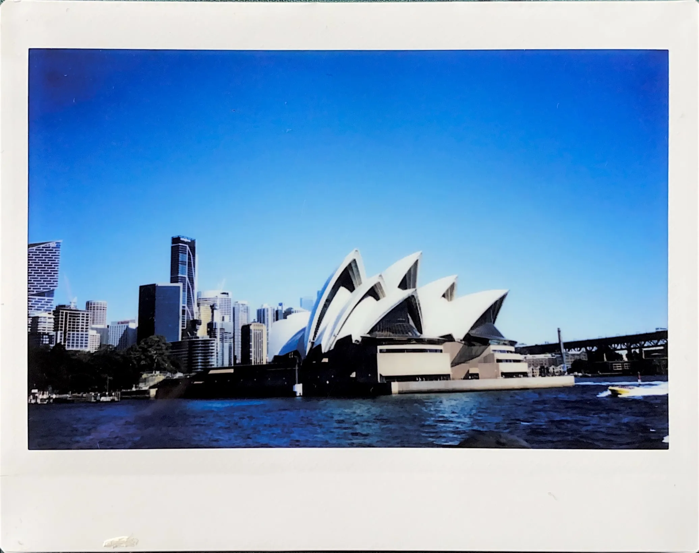

+++
title = "Comment obtenir un DD à Sydney !?"
description = "Tu es un jeune ISMIN&nbsp;? Tu regardes les moutons dans le patio avec désarroi&nbsp;? Tu fantasmes sur une vida loca dans une grande ville, à l’opposé de Gardanne&nbsp;? Tu rêves d’aller à une plage encore plus accessible et plus bondée que le Prado&nbsp;? Cet article est fait pour toi&nbsp;!🫵"
date = 2024-12-01
[taxonomies]
tags = ["Sydney", "UTS"]
[markdown]
numbersections = true
[extra]
toc = true
katex = true
subtitle = "TUTO (2024) (HACK)"
+++

<figcaption>Fig. 1 : L'Opéra de Sydney - Instax Wide 300</figcaption>

Le but de cet article est de retranscrire ce que j'ai vécu (**administrativement** et **scolairement** parlant) pour atterrir sur la plage de Bondi, après avoir assisté à un cours de l'Université Technologique de Sydney (UTS). Je pense que je suis le premier ISMIN à faire ça. C'était incroyablement stressant de faire ce procédé sans aucun alumni issu de Charpak, à qui poser des questions. J'espère que cet article aidera à comprendre comment ça marche. J'écrirai un autre article sur la vie à Sydney et à l'UTS.


Les infos sur cette page peuvent être obsolêtes. Ne vous reposez pas seulement sur cet article, faites vos propres recherches, allez vous renseigner au pôle international.


## Comment ça a commencé

On est en décembre, c'est l'heure de faire ses vœux pour les DD et les échanges. J'ai pas spécialement envie de rester dans notre belle ville rouge, je rêve de grandiose. J'aperçois l'UTS sur eCampus. 

Le DD ne dure qu'1 (un) (uno) (ein) (one) (un mais en espagnol) an seulement. J'ai fait 5/2 ; j'ai pas envie de rajouter du temps d'étude dans ma vie. Je veux devenir un actif le plus tôt possible. C'est à Sydney. C'est une grande ville. C'est loin. Ça peut être une bonne aventure. Bref, j'accroche. 

Regardons ce que l'université offre de plus près.

## Qu'est-ce qu'on étudie à l'UTS ?
Oui, j'avoue, je me suis aussi beaucoup imaginé en train de surfer avec les wallabys. Faut pas oublier ce qu'on cherche ici, c'est un DD. Alors parlons de ce qui est disponible côté éducation. Depuis le partenariat IMT-UTS, on a accès à trois diplômes :
- [_Master of Engineering_](https://www.uts.edu.au/study/find-a-course/master-engineering)
- [_Master of Engineering Management_](https://www.uts.edu.au/study/find-a-course/master-engineering-management)
- [_Master of Environmental Engineering Management_](https://www.uts.edu.au/study/find-a-course/master-environmental-engineering-management)

Ils durent tous un an.

## Le Master of Engineering

J'ai pas envie de faire que du management, donc je vais direct m'informer sur le _Master of Engineering_ (MoE) "tout-court". Direction [le site de l'UTS](https://www.uts.edu.au/study/find-a-course/master-engineering).

<figcaption>Fig. 2 : Site internet de l'UTS</figcaption>

### Les majeures

Voilà les majeures que le diplôme MoE offre :
- _Biomedical Engineering_
- _Civil Engineering_
- _Computer Control Engineering_
- _Cybersecurity Engineering_
- _Electrical Energy Systems_
- _Environmental Engineering_
- _Geotechnical Engineering_
- _Mechanical Engineering_
- _No specified major stream_
- _Robotics_
- _Software Systems Engineering_
- _Structural Engineering_
- _Telecommunications and Electronics_
- _Water Engineering_
- _Tunnelling and Underground Engineering_


L'UTS peut refuser une majeure !! On choisit 3 majeures lors de l'inscription, et on les classe style SCEI/Parcoursup/APB. Je connais une fille de l'IMT Atlantique qui s'est fait refusés ses deux premiers choix, car l'UTS aimait pas son parcours précédent. Je pense qu'on a accès à l'élec., la robotique et les trucs d'info.


### Le plan de cours


Ce guide de plan de cours ne marche que pour le MoE. Pour les autres masters (management, environmental), je ne sais pas exactement comment ça se déroule. Cependant, la structure doit être assez similaire.


L'UTS permet de choisir son parcours. Le MoE, dans le cadre du DD, est composé de huit matières. Chacune d'entre elles valent 7,5 ECTS (et 8 $\times$ 7,5 ECTS = 60 ECTS). 

L'université utilise des _credit points_ (cp) à la place des ECTS. 24 cp sont équivalents à 30 ECTS. Ces matières se séparent en 4 catégories. Voilà un tableau général du plan de cours en MoE:

<figcaption>Tableau 1 : À quoi ressemble un plan de cours à l'UTS pour un MoE</figcaption>

| **Catégorie**                                                                            | **Matière**                                                                          | **Nombre de crédits (UTS)** | **Nombre de crédits (ECTS)** |
| ---------------------------------------------------------------------------------------- | ------------------------------------------------------------------------------------ | --------------------------- | --------------------------- |
| [_Project stream_](https://handbook.uts.edu.au/directory/stm90859.html)                  | [_Engineering Project Preparation_](https://handbook.uts.edu.au/subjects/42908.html) | 6 cp                        | 7,5 cp                        |
| [_Project stream_](https://handbook.uts.edu.au/directory/stm90859.html)                  | [_Engineering Graduate Project_](https://handbook.uts.edu.au/subjects/42003.html)    | 6 cp                        | 7,5 cp                        |
| _Major core_                                                                             | Matière obligatoire selon la majeure choisie \#1                                     | 6 cp                        | 7,5 cp                        |
| _Major core_                                                                             | Matière obligatoire selon la majeure choisie \#2                                     | 6 cp                        | 7,5 cp                        |
| _Major choice_                                                                           | Matière au choix \#1                                                                 | 6 cp                        | 7,5 cp                        |
| _Major choice_                                                                           | Matière au choix \#2                                                                 | 6 cp                        | 7,5 cp                        |
| [_Professional Engineering choice_](https://handbook.uts.edu.au/directory/cbk90955.html) | Matière au choix \#1                                                                 | 6 cp                        | 7,5 cp                        |
| [_Professional Engineering choice_](https://handbook.uts.edu.au/directory/cbk90955.html) | Matière au choix \#2                                                                 | 6 cp                        | 7,5 cp                        |

Les matières associées à chaques majeures sont disponibles [ici](https://coursehandbook.uts.edu.au/course/2025/C04271), puis `Structure > Structure > Majors > [majeure choisie]`.


Sur le lien vers le "handbook" que j'ai donné juste au-dessus, ne prêtez surtout pas attention aux totaux de crédits nécessaire qui y sont écrit (Les "18 Credit Points", "42 Credit Points", "12 Credit Points"...)

<fig>
{{ image(url="img/ects.webp#transparent", transparent=true) }}
<figcaption>Fig. 3 : Je vais rester poli parce qu'il y a des chances que l'administration lise ça.</figcaption>
</fig>

J'explique tout ici :


Dans le cadre du DD IMT-UTS (et seulement dans le cadre du DD), les élèves ne doivent pas cumuler 18+42+12 _credit points_ (cp) avec le major choice, mais bien <mark>36 cp</mark>. Au lieu d'avoir 3 matières au choix dans la majeure, on en a 2. Au lieu de 3 matières dans le "Professional Engineering stream", on en a 2. On a aussi aucune "elective".

Résumons tout ça. On a :

- 2 $\times$ 6 cp pour le "Project stream", 
- 2 $\times$ 6 cp pour les matières au choix dans la majeure, 
- 2 $\times$ 6 cp pour les matières obligatoires dans la majeure,
-  2 $\times$ 6 cp pour les matières de management ("Professional Engineering"). 

Ça fait bien (2 $\times$ 6) $\times$ 4 = 48 cp, soit 60 ECTS. Voilà.

Par exemple, voilà mon plan de cours :

Je flashe sur _Telecommunications and Electronics_. J'aime bien l'électronique, et je trouve qu'on a pas assez fait de RF à Gardanne. C'est parfait.

<figcaption>Tableau 2 : Plan de cours personnel</figcaption>

| **Catégorie**                                                                            | **Matière**                                                                                |
| ---------------------------------------------------------------------------------------- | ------------------------------------------------------------------------------------------ |
| [_Project stream_](https://handbook.uts.edu.au/directory/stm90859.html)                  | [_Engineering Project Preparation_](https://handbook.uts.edu.au/subjects/42908.html)       |
| [_Project stream_](https://handbook.uts.edu.au/directory/stm90859.html)                  | [_Engineering Graduate Project_](https://handbook.uts.edu.au/subjects/42003.html)          |
| _Major core_                                                                             | [_Wireless Sensor Networks_](https://handbook.uts.edu.au/subjects/49227.html)              |
| _Major core_                                                                             | [_Communication Protocols_](https://handbook.uts.edu.au/subjects/49202.html)               |
| _Major choice_                                                                           | [_4G/5G Mobile Technologies_](https://handbook.uts.edu.au/subjects/42890.html)             |
| _Major choice_                                                                           | [_Electronic Components and Fabrication_](https://handbook.uts.edu.au/subjects/42059.html) |
| [_Professional Engineering choice_](https://handbook.uts.edu.au/directory/cbk90955.html) | [_Risk Management in Engineering_](https://handbook.uts.edu.au/subjects/49006.html)        |
| [_Professional Engineering choice_](https://handbook.uts.edu.au/directory/cbk90955.html) | [_Managing Projects_](https://handbook.uts.edu.au/subjects/49002.html)                     |

<!-- ## Le visa

Le visa se fait majoritairement en ligne. Il coûte 1600 AUD (~1000 €).

Le DD UTS est un "master by coursework". Cochez bien ça lors de la demande du visa.


### Les CoE

Si l'UTS accepte l'inscription, elle va envoyer deux _Confirmation of Enrollment_ (CoE). Une pour le premier semestre, une pour le deuxième. C'est des documents nécessaires à l'obtention du visa.


J'AI FAIT UNE GRAVE ERREUR LIÉE AUX CoE !!! Lorsque j'ai fait mon visa, j'ai utilisé qu'une seule CoE. Mon visa se terminait seulement alors après le 1er semestre. J'ai dû refaire un visa pour le deuxième semestre. Pourquoi cette erreur ? Parce que l'UTS envoie d'abord la CoE du 1er semestre, pour le "Study Abroad", puis demande de payer 60€ (si je me souviens bien) pour obtenir la deuxième CoE (oui, soixante balles). J'avais pas vu et j'ai fait mon visa avant de comprendre ça.


### L'OSHC

Le visa demande d'avoir une OSHC (Overseas Student Health Cover). L'UTS a un partenariat avec [Medibank](https://www.medibank.com.au/overseas-health-insurance/oshc/uts/) pour ça. C'est une mutuelle (privée) qui fait les trucs de base. C'est 651 AUD pour un an.

### Les empreintes digitales

Après avoir complété le visa, le gouvernement australien demande de se faire prendre ses empreintes digitales. C'est écrit dans un mail qui arrive quelques jours après avoir envoyé la demande. Pour ça, il faut allez dans un bureau particulier à Paris. Ça coûte 50 €[^argent]. Par chance mon stage de 2A était à Paris. Après ça, le visa devrait être accepté quelques semaines plus tard.

---

Si vous avez des questions, envoyez moi un mail à [lucien.gheerbrant@proton.me](mailto:lucien.gheerbrant@proton.me).

[^marques]: J'ai raté le projet robot, qui n'a pas de rattrapage normalement. J'ai fait des turbos saltos arrière niveau 12 face à Marques afin de le passer pour aller en Australie.

[^argent]: Ouais, il y a pleins de petits gros coûts comme ça.
 -->
